# XGXunFeiLink  

## Brief  

This is XGXunFeiLink project,which it helps to connect iFlyTek with  UnrealEngine 5.  
At pressent,It contains Five functions :   

a.Automated Speech Recognition(Real-time ASR,ASRG)--Global  
b.Online TTS(TTSG)--Global  
c.Real-Time Speech To Text(STT)--No Global   
d.Text To Speech Stream(TTS)--No Global  
e.Spark(Spark)--No Global  

It contains two parts:   
The First  is the XGXunFeiLink plugin, which is commercial.You can purchase it through Unreal Engine Marketplace.The part of code is only for learning.
The Second is the XGKeDaXunFeiSoud plugin,which is just study demo code. Please do not use it in a formal situation.

Demo Video URL:
https://youtu.be/6NQ4PO2RpOU


## XGXunFeiLink  

### 0.Important Things

iFlyTek provides a lot of Web API both in China or in the global region.

This plugin supports these WebAPI in different region. 

Most of WebAPI seem to be similar.

However,they are really different.  
You need different accounts,AppID,APIKey,APISecret,especially when you are in China and out of China.
Keep in mind that right App information correspond with right Web API.

### 1.Get App Information

If you don't create the iFlyTek App,you should create it.

iFlyTek Web(Chinese site,No Global):

https://www.xfyun.cn/

iFlyTek Web(English site,Global):

https://global.xfyun.cn/

Although the code is similar,Only when iFlyTek supports Web API in these regions,this plugin can work .

You have to register your account and manage your App information through different sites.

It is not very difficult to do . You can translate this web page directly through the browser tool.

I have translated some important interface parameters in my codes and documents.

After you create the App, you should enable corresponding function in your iFlyTek control panel,such as STT ,TTS,Spark.

Be careful that some functions are not free.Howover,You can try it for free in a short time.
  
### 2.Set App Information To Plugin

ASRG needs:  

App_ID_RealTimeASR_Global,  
API_Secret_RealTimeASR_Global,  
API_Key_RealTimeASR_Global

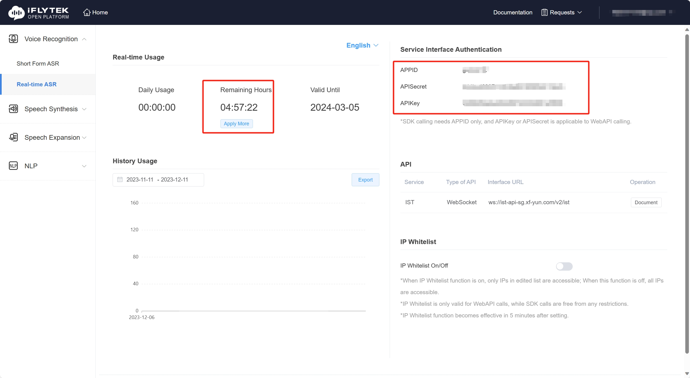  

TTSG needs:

App_ID_OnlineTTS_Global  
API_Secret_OnlineTTS_Global  
API_Key_OnlineTTS_Global  


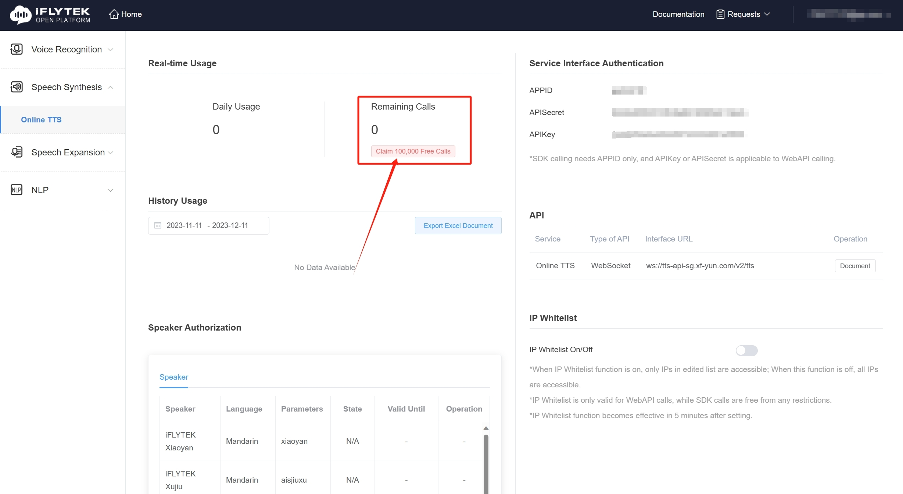  

STT needs:

App_ID_RealTimeSTT,	API_Key_RealTimeSTT;  

The Picture after it was translated by the browsing tools is as follow:

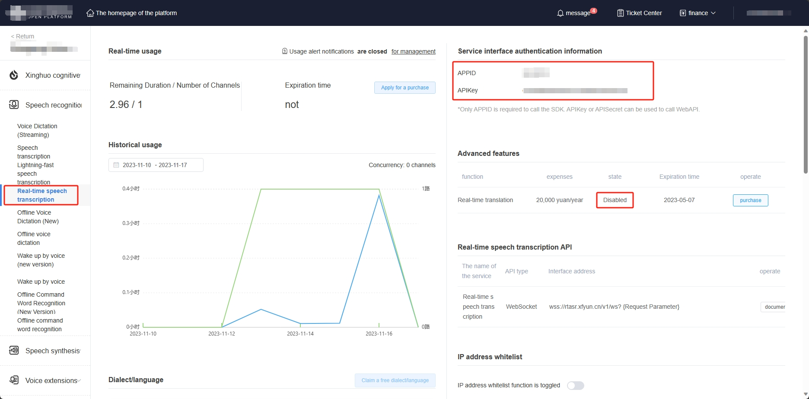  

TTS needs:

App_ID_TTSStream,	API_Key_TTSStream,	API_Secret_TTSStream;

The Picture after it was translated by the browsing tools is as follow:

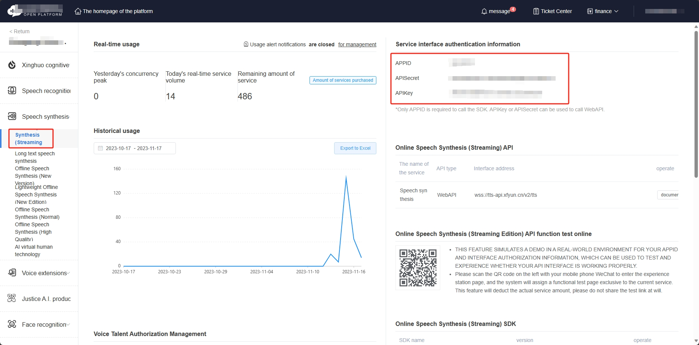      

Spark needs:

Different Spakrversion shares the same App information,but the calculation method is different.

App_ID_Spark,	API_Key_Spark,	API_Secret_Spark;  

The Picture after it was translated by the browsing tools is as follow:  


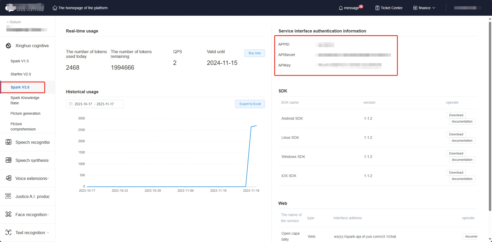     

You can set it in Project Settings->XGPlugins->XGXunFeiCoreSettings.

Remember Enable Plugins XGXunFeiLink.

Be careful that APIKey and APISecret are confused simply.

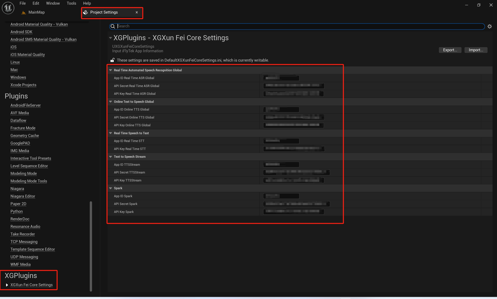     


### 3.Begin Or Stop RealTime STT(No Global)
  
      

You can call XunFeiBeginRealTimeSpeechToText to begin STT.

You can call XunFeiStopRealTimeSpeechToText to end STT.

It captures audio data from audio input device,and then send it to iFLyTek Web API.

It will call you to recive results.

It calls you to recive results ,src text,dst text.

#### 3.1 Be Careful:

Defualt audio input device must in

[48000 kHz,16 bits, 2 channle],

[48000 kHz,16 bits, 1 channle],

[16000 kHz,16 bits, 1 channle].

If your audio input device is not right,you wil not get src text or dst text.  

#### 3.2 Delegate:  

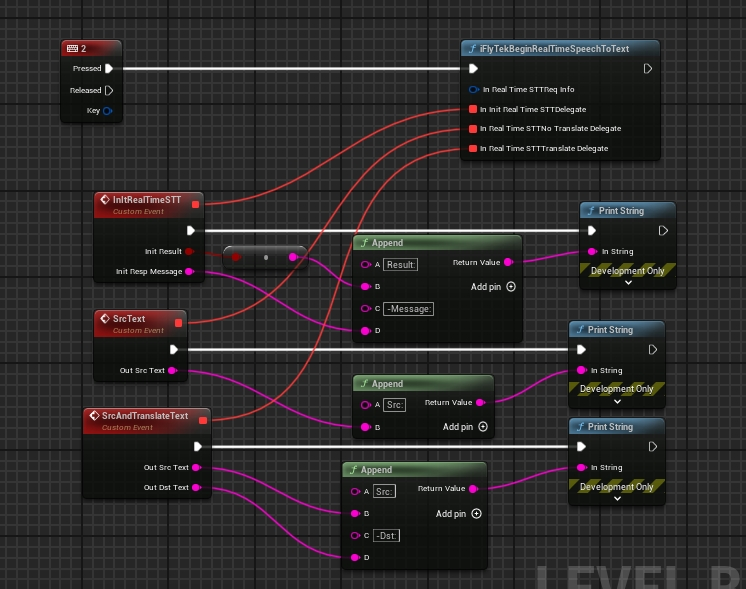  

InitRealTimeSTTDelegate: Tell you whethe to create the connection to iFlyTek successfully.
If you fail,you will get the reason.  

RealTimeSTTNoTranslateDelegate:After create the connection successfully,you can get every sentence src text.

RealTimeSTTTranslateDelegate:After Create the connection successfully, if plugin and iFlyTek control panel enable translation funntion,you will get everysentence src text and dst text.

#### 3.3 ReqInfo:
  
  
```
	/**
	 * Parameter:lang
	 * Type:string
	 * Required:No
	 * Description:Real-time speech transfer language.The default is Chinese.
	 * Example:
	 *			Language type：
	 *			Chinese、ChineseAndEnglish：cn；
	 *			Engilis：en；
	 *			Minor languages and dialects can be added from the iFlyTek control panel console.you can get corresponding parameters.
	 *			For example："lang=en"
	 * Error 10110 is reported,  if unauthorised .
	 */
	UPROPERTY(EditAnywhere, BlueprintReadWrite, Category = "XG XunFei RealTime STT")
	FString lang = TEXT("cn");
```
```
	/**
	 * Custom fields Whether to enable the translation function
	 * Note: Translation function needs to be enabled on the iFlyTek control panel console.
	 */
	UPROPERTY(EditAnywhere, BlueprintReadWrite, Category = "XG XunFei RealTime STT")
	bool bEnableTranslate = false;
```
```
	/**
	 * Parameter:transType
	 * Type:string
	 * Required:No
	 * Description:
	 *				"normal" explains general translation. The default is "normal"；
	 * Example:	transType="normal"
	 * Note: Translation function needs to be enabled on the iFlyTek control panel console.
	 */
	UPROPERTY(EditAnywhere, BlueprintReadWrite, Category = "XG XunFei RealTime STT")
	FString transType = TEXT("normal");
```
```
    /**
	 * Parameter:transType
	 * Type:int
	 * Required:No
	 * Description:
	 *		Strategy 1: Transcribe the VAD results directly to be translated;
	 *		Strategy 2: which returns the results of the intermediate process;
	 *		Strategy 3: Request a translation based on the final punctuation split transcription result;
	 *		Policy 2 is recommended.
	 * Example:
	 *		transStrategy=2
	 * Note: Translation function needs to be enabled on the iFlyTek control panel console.
	 */
	UPROPERTY(EditAnywhere, BlueprintReadWrite, Category = "XG XunFei RealTime STT")
	int32 transStrategy = 2;
```

```
	/**
	 * Parameter:targetLang
	 * Type:string
	 * Required:No
	 * Description:
	 *		Target Languages: Control what type of language the source language is converted to;
	 *		Please note that similar to converting from English to French, Chinese must be used as the transition language, that is, English-Chinese-French, and direct conversion between languages excluding Chinese is not supported.
	 *		Chinese: cn
	 *		English: en
	 *		Japanese: ja
	 *		Korean: ko
	 *		Russian: ru
	 *		French:fr
	 *		Spanish: es
	 *		Vietnamese: vi
	 *		Cantonese: cn_cantonese
	 * Example:
	 *		Such as：targetLang="en"
	 *		If you use Chinese real-time translation to English parameter passing Example is as follows:
	 *		"&lang=cn&transType=normal&transStrategy=2&targetLang=en"
	 * Note: Translation function needs to be enabled on the iFlyTek control panel console.
	 */
	UPROPERTY(EditAnywhere, BlueprintReadWrite, Category = "XG XunFei RealTime STT")
	FString targetLang = TEXT("en");
```
```
	/**
	 * Parameter:punc
	 * Type:string
	 * Required:No
	 * Description:	Punctuation filter control, punc is returned by default, punc=0 will filter punctuation in the results
	 * Example: 0
	 */
	UPROPERTY(EditAnywhere, BlueprintReadWrite, Category = "XG XunFei RealTime STT")
	FString punc = TEXT("None");
```
```
	/**
	 * Parameter:pd
	 * Type:string
	 * Required:No
	 * Description:
	 *		Vertical Personalization Parameters:
	 *		Court: court
	 *		Education: edu
	 *		Finance: finance
	 *		Medical: medical
	 *		Technology: tech
	 *		Operator: isp
	 *		Government: gov
	 *		E-Commerce: ecom
	 *		Military: mil
	 *		Enterprise: com
	 *		Life: life
	 *		Car: car
	 * Example:
	 *		Such as ：pd="edu"
	 *		Parameter pd is optional. If no parameter is set, it is common by default
	 */
	UPROPERTY(EditAnywhere, BlueprintReadWrite, Category = "XG XunFei RealTime STT")
	FString pd = TEXT("None");
```
```
	/**
	 * Parameter:vadMdn
	 * Type:int
	 * Required:No
	 * Description:
	 *			Switch between far and near field, do not pass this parameter or pass 1 for the far field and pass 2 for the near field
	 * Example:	Such as ：vadMdn=2
	 */
	UPROPERTY(EditAnywhere, BlueprintReadWrite, Category = "XG XunFei RealTime STT")
	int32 vadMdn = -1;
```
```
	/**
	 * Parameter:roleType
	 * Type:int
	 * Required:No
	 * Description:
	 *			Whether to enable character separation, it is not enabled by default, and transmission 2 is enabled
	 *			(the effect is continuously optimized)
	 * Example:	Such as ：roleType=2
	 */
	UPROPERTY(EditAnywhere, BlueprintReadWrite, Category = "XG XunFei RealTime STT")
	int32 roleType = -1;
```

```
	/**
	 * Parameter:engLangType
	 * Type:int
	 * Required:No
	 * Description:
	 *		Language recognition mode selection, default is mode 1 Chinese and English mode:
	 *		1: Automatic Chinese and English mode
	 *		2: Chinese mode, may include a small amount of English
	 *		4: Pure Chinese mode, does not include English
	 * Example:	Such as ：engLangType=4
	 */
	UPROPERTY(EditAnywhere, BlueprintReadWrite, Category = "XG XunFei RealTime STT")
	int32 engLangType = -1;  
```
You can keep it default for test at first.

#### 3.4 C++ API

Same to Blueprint.


```

	/**
	 * XunFeiBeginRealTimeSpeechToText
	 *
	 * @param WorldContextObject				WorldContext
	 * @param InRealTimeSTTReqInfo				RealTimeSpeechToTextSettings,you can do nothing to keep default.
	 * Default lanaguge is Chinese,you can change to Chinese to Enginsh,such as "cn"->"en". Default No Translate,just Src.if you need to translate,you need to open it function in XunFei web.
	 * @param InInitRealTimeSTTDelegate			Tell you whether to success to create socket to XunFei and begin to audio capture.
	 * if your app key and id are not right,you will fail.if your audio input device is not good,you will fail.
	 * Suggest audio input [48000 kHz,16 bits, 2 channle][48000 kHz,16 bits, 1 channle][16000 kHz,16 bits, 1 channle],thest can work well.
	 * @param InRealTimeSTTNoTranslateDelegate	Give you Src Speech to Text .
	 * @param InRealTimeSTTTranslateDelegate	Give you Src Speech to Text Src and Target Translate Text.
	 * If your app Id support and you open it in this plugin.More to look XunFeiDoc.
	 */
	UFUNCTION(BlueprintCallable, meta = (DisplayName = "XunFeiBeginRealTimeSpeechToText", WorldContext = "WorldContextObject",
		Keywords = "XG XunFei STT SPeech To Text "), Category = "XGXunFeiLink|STT")
	static void XGXunFeiBeginRealTimeSpeechToText(const UObject* WorldContextObject,
		FXGXunFeiRealTimeSTTReqInfo InRealTimeSTTReqInfo,
		FXGXunFeiInitRealTimeSTTDelegate InInitRealTimeSTTDelegate,
		FXGXunFeiRealTimeSTTNoTranslateDelegate InRealTimeSTTNoTranslateDelegate,
		FXGXunFeiRealTimeSTTTranslateDelegate InRealTimeSTTTranslateDelegate);


	/**
	 *
	 * XunFeiStopRealTimeSpeechToText
	 *
	 * @param WorldContextObject WorldContext
	 */
	UFUNCTION(BlueprintCallable, meta = (DisplayName = "XunFeiStopRealTimeSpeechToText", WorldContext = "WorldContextObject",
		Keywords = "XG XunFei STT SPeech To Text "), Category = "XGXunFeiLink|STT")
	static void XGXunFeiStopRealTimeSpeechToText(const UObject* WorldContextObject);

```


### 4.Begin TTS Sream  (No Global)
  
    

You can call XunFeiTextToSpeech to begin TTS.

It is a async blueprint node.

It converts text to USoundWave and wav file.

#### 4.1 Be Careful:

You have to input the text to convert it.

If you enable bSaveToLocal,you must input the right and absolute file path.

The directory must exist.

The file name must end with ".wav"

You can keep it default for test at first.

#### 4.2 Delegate:

On Success: you will get the USoundWave

On Fail:you will get nullptr and reason.

#### 4.3 ReqInfo:

    
```
	/**
	 * Parameter:vcn
	 * Type:string
	 * Required:Yes
	 * Description:
	 *		Pronunciation person, optional value: 
	 *		"xiaoyan",
	 *		"aisjiuxu",
	 *		"aisxping",
	 *		"aisjinger",
	 *		"aisbabyxu"
	 *		Please go to the console to add a trial or purchase pronunciation person, after     adding the pronunciation person Parameter value will be displayed
	 * Example:
	 *		"xiaoyan"
	 *
	 */
	UPROPERTY(EditAnywhere, BlueprintReadWrite, Category = "XG iFylTek TTS")
	FString vcn = TEXT("xiaoyan");

```

```
	/**
	 * Parameter:speed
	 * Type:int
	 * Required:No
	 * Description:
	 *		The value is optional: [0-100]. The default value is 50
	 * Example:
	 *		50
	 *
	 */
	UPROPERTY(EditAnywhere, BlueprintReadWrite, Category = "XG iFylTek TTS")
	int32 speed = 50;

```


```
	/**
	 * Parameter:volume
	 * Type:int
	 * Required:No
	 * Description:
	 *		The value is optional: [0-100]. The default value is 50
	 * Example:
	 *		50
	 *
	 */
	UPROPERTY(EditAnywhere, BlueprintReadWrite, Category = "XG iFylTek TTS")
	int32 volume = 50;

```

```
	/**
	 * Parameter:pitch
	 * Type:int
	 * Required:No
	 * Description:
	 *		The value is optional: [0-100]. The default value is 50
	 * Example:
	 *		50
	 *
	 */
	UPROPERTY(EditAnywhere, BlueprintReadWrite, Category = "XG iFylTek TTS")
	int32 pitch = 50;

```

```
	/**
	 * Parameter:bgs
	 * Type:int
	 * Required:No
	 * Description:
	 *		Background sound for synthesized audio
	 *			0: No background sound (default)
	 *			1: Background sound
	 * Example:
	 *		0
	 *
	 */
	UPROPERTY(EditAnywhere, BlueprintReadWrite, Category = "XG iFylTek TTS")
	int32 bgs = 0;

```
```

	/**
	 * Parameter:reg
	 * Type:string
	 * Required:No
	 * Description:
	 *		Set English pronunciation:
	 *			0: Automatic judgment processing, if not sure will be processed according to the English word spelling (default)
	 *			1: All English is pronounced alphabetically
	 *			2: Automatic judgment processing, if not sure will be read according to the letter
	 *		Default pronunciation according to English words
	 * Example:
	 *		"2"
	 *
	 */
	UPROPERTY(EditAnywhere, BlueprintReadWrite, Category = "XG iFylTek TTS")
	FString reg = TEXT("2");

```
```
	/**
	 * Parameter:rdn
	 * Type:string
	 * Required:No
	 * Description:
	 *		Synthetic audio digital pronunciation
	 *			0: Automatic judgment (default)
	 *			1: full value
	 *			2: complete string
	 *			3: The string takes precedence
	 * Example:		"0"
	 *
	 */
	UPROPERTY(EditAnywhere, BlueprintReadWrite, Category = "XG iFylTek TTS")
	FString rdn = TEXT("0");

```


You can keep it default for test at first.

The Picture after it was translated by the browsing tools is as follow:
The Picture Shows where to add a new speeker.
    

#### 4.4 C++API  

```
	/**
	 * XGXunFeiTextToSpeech
	 *
	 * @param WorldContextObject		WorldContext
	 * @param InText					The Str you want to Convert to Audio
	 * @param bInSaveToLocal			Whether to Save to local disk
	 * @param InSaveFileFullPath		The FilePath which the wmv file will save to .
	 * This directory must exist,and the file name must end with ".wav"
	 * This path is absoult path!
	 * @param InXunFeiTTSReqInfo		About TTS Settins,more to look iflytesk document.you can choos which voice to say,and so on.
	 * @param OnXunFeiTTSSuccess		if success ,you will get USoundWave.
	 * @param OnXunFeiTTSFail			if faile,you will get reason.
	 */
	static void XGXunFeiTextToSpeech(UObject* WorldContextObject,
		const FString& InText,
		bool bInSaveToLocal,
		const FString& InSaveFileFullPath,
		FXGXunFeiTTSReqInfo InXunFeiTTSReqInfo,
		FXGXunFeiTTSDelegate OnXunFeiTTSSuccess,
		FXGXunFeiTTSDelegate OnXunFeiTTSFail);

```

### 5. Begin Sprak    (No Global)

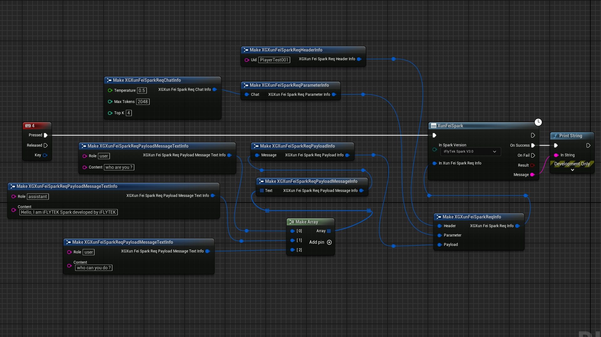

You can call XunFeiSpark to begin Spark.

You can communicate with Spark(v1.5,v2.0,v3.0).

#### 5.1 Be Careful  

Although the Spark has the same App information(AppID_Spark,APIKey_Spark,API_Secret_Spark)，the  different  Spark version has different authority management and token management.  

#### 5.2 Delegate  


On Success: You will get true and the message(Spark send it to you).
  
On Fail: You will get false and the message(why to fail)  

#### 5.3 ReqInfo    
  

You can choose different Spark Versions from InSparkVersion.

You should input right information to InXunFeiSparkReqInfo.

##### 5.3.1 FXGXunFeiSparkReqInfo  

      

Header: About user ID.  

Paramter:About Spark settings.  

Payload:Text contents.  

##### 5.3.2 FXGXunFeiSparkReqHeaderInfo

      

```
	/**
	 * Parameter:uid
	 * Type:string
	 * Required:No
	 * Description:
	 *		Maximum length 32
	 * Description:
	 *		Id of each user, which is used to distinguish different users
	 *
	 */
	UPROPERTY(EditAnywhere, BlueprintReadWrite, Category = "XG iFylTek Spark")
	FString uid = TEXT("None");


```
##### 5.3.3 FXGXunFeiSparkReqParameterInfo

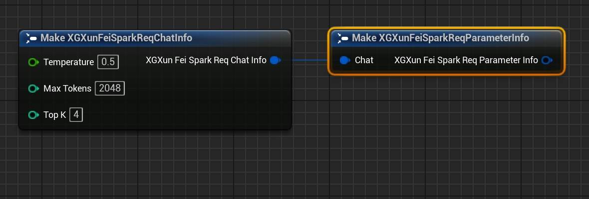      

```
	/**
	 * Parameter:temperature
	 * Type:float
	 * Required:No
	 * Description:
	 *		The value is [0,1], and the default value is 0.5
	 * Example:
	 *		Nuclear sampling threshold. 
	 *		It is used to determine the randomness of the result. The higher the value, the stronger the randomness, that is, the higher the possibility of getting different answers to the same question
	 *
	 */
	UPROPERTY(EditAnywhere, BlueprintReadWrite, Category = "XG iFylTek Spark")
	float temperature = 0.5;

```


```
	/**
	 * Parameter:max_tokens
	 * Type:int
	 * Required:No
	 * Description:
	 *		V1.5,The value is [1,4096]
	 *		V2.0,The value is [1,8192]， and the default value is 2048。
	 *		V3.0,The value is [1,8192]， and the default value is 2048。
	 * Example:
	 *		The maximum length of tokens that the model answers
	 *
	 */
	UPROPERTY(EditAnywhere, BlueprintReadWrite, Category = "XG iFylTek Spark")
	int32 max_tokens = 2048;

```

```
	/**
	 * Parameter:top_k
	 * Type:int
	 * Required:No
	 * Description:
	 *		The value is[1，6],and the default value is4
	 * Example:
	 *		Randomly select one of k candidates (non-equal probability)
	 *
	 */
	UPROPERTY(EditAnywhere, BlueprintReadWrite, Category = "XG iFylTek Spark")
	int32 top_k = 4;

```
##### 5.3.4 FXGXunFeiSparkReqPayloadInfo

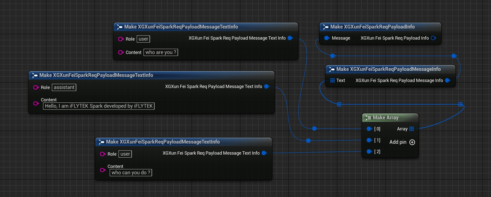      

You can input history text contents to the array.  

The last text element must be your question.

If you do not have the histroy ,the last text will be the only element in the array.

```
	/**
	 * Parameter:role
	 * Type:string
	 * Required:Yes
	 * Description:
	 *		The Value is [user,assistant]
	 * Example:
	 *		"user" indicates the user's problem, and "assistant" indicates the AI's reply
	 *
	 */
	UPROPERTY(EditAnywhere, BlueprintReadWrite, Category = "XG iFylTek Spark")
	FString role;

```

```
	/**
	 * Parameter:content
	 * Type:string
	 * Required:Yes
	 * Description:
	 *		All content tokens need to be controlled within 8192
	 * Example:
	 *		The conversation between the user and the AI
	 *
	 */
	UPROPERTY(EditAnywhere, BlueprintReadWrite, Category = "XG iFylTek Spark")
	FString content;

```

#### 5.4 C++ API  


```
	/**
	 * Connect to iFlyTek Spark
	 *
	 * @param WorldContextObject		WolrdContext
	 * @param InSparkVersion			Which Spark version you choose to use. (V1.5,V2.0,V3.0)
	 * @param InXunFeiSparkReqInfo		The important infomation about Spakr settings.
	 * @param OnXunSparkSuccess			if success ,you will get text.
	 * @param OnXunSparkFail			if faile,you will get reason.
	 */
	static void XGXunFeiSpark(UObject* WorldContextObject,
		EXGXunFeiSparkVersion InSparkVersion,
		FXGXunFeiSparkReqInfo InXunFeiSparkReqInfo,
		FXGXunFeiSparkDelegate OnXunSparkSuccess,
		FXGXunFeiSparkDelegate OnXunSparkFail);

```


### 6. Begin ASRG    (Global)
  
This API is similar with STT.  

      

You can call XunFeiBeginRealTimeASRG to begin ASRG.

You can call XunFeiStopRealTimeASRG to end ASRG.

It captures audio data from audio input device,and then send it to iFLyTek Web API.

It will call you to recive results.

It calls you to recive results ,src text.

#### 6.1 Be Careful:

Defualt audio input device must in

[48000 kHz,16 bits, 2 channle],

[48000 kHz,16 bits, 1 channle],

[16000 kHz,16 bits, 1 channle].

If your audio input device is not right,you wil not get src text or dst text.  

#### 6.2 Delegate:  

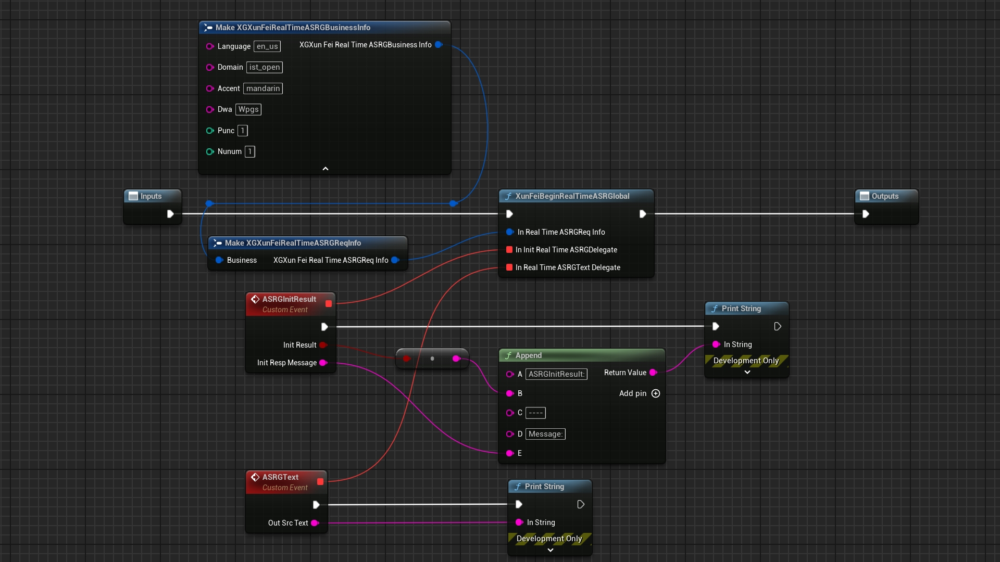  

InitRealTimeASRGDelegate: Tell you whethe to create the connection to iFlyTek successfully.
If you fail,you will get the reason.  

ASRGTextDelegate:After create the connection successfully,you can get every sentence src text.


#### 6.3 ReqInfo:
  
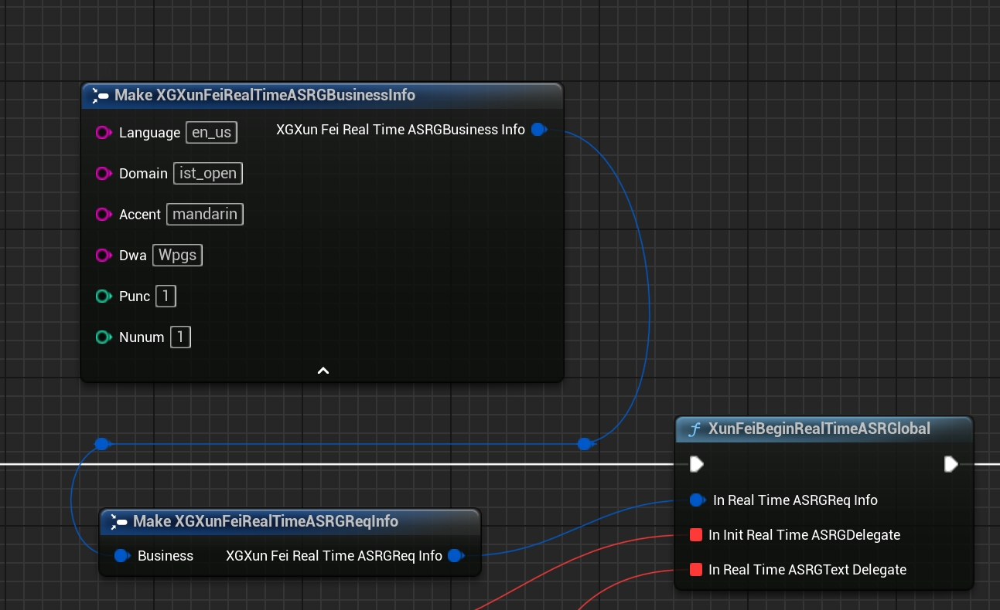  
```
	/**
	 * Parameter:language
	 * Type:string
	 * Required:Yes
	 * Description:Along with the domain and accent parameters in each engine type. For the detailed relationship, see the parameter list below.
	 *
	 * Languages:Chinese,English
	 * Parameter:zh_cn,en_us
	 * accent:mandarin,mandarin
	 * domain:ist_open,ist_open
	 * Note:sms_ed_open,sms_en_open,
	 */
	UPROPERTY(EditAnywhere, BlueprintReadWrite, Category = "XG iFylTek ASRG")
	FString language = TEXT("en_us");
```
```
	/**
	 * Parameter:domain
	 * Type:string
	 * Required:Yes
	 * Description:Along with the domain and accent parameters in each engine type. For the detailed relationship, see the parameter list below.
	 *
	 * Languages:Chinese,English
	 * Parameter:zh_cn,en_us
	 * accent:mandarin,mandarin
	 * domain:ist_open,ist_open
	 * Note:sms_ed_open,sms_en_open,
	 */
	UPROPERTY(EditAnywhere, BlueprintReadWrite, Category = "XG iFylTek ASRG")
	FString domain = TEXT("ist_open");
```
```
	/**
	 * Parameter:accent
	 * Type:string
	 * Required:Yes
	 * Description:Along with the domain and accent parameters in each engine type. For the detailed relationship, see the parameter list below.
	 *
	 * Languages:Chinese,English
	 * Parameter:zh_cn,en_us
	 * accent:mandarin,mandarin
	 * domain:ist_open,ist_open
	 * Note:sms_ed_open,sms_en_open,
	 */
	UPROPERTY(EditAnywhere, BlueprintReadWrite, Category = "XG iFylTek ASRG")
	FString accent = TEXT("mandarin");
```
```
	/**
	 * Parameter:dwa
	 * Type:string
	 * Required:No
	 * Description:	
	 * Engine extension parameters.
	 *		Wpgs: used to enable the streaming result return feature
	 *		Note: This expanded feature cannot be used without AppID, you can activate it at the console- Real-time ASR (Automatic Speech Recognition)
	 */
	UPROPERTY(EditAnywhere, BlueprintReadWrite, Category = "XG iFylTek ASRG")
	FString dwa = TEXT("Wpgs");
```

```
	/**
	 * Parameter:punc
	 * Type:int
	 * Required:No
	 * Description:
	 * Punctuation control (with punctuation by default). Pass punc=0 to disabled punctuation.
	 */
	UPROPERTY(EditAnywhere, BlueprintReadWrite, Category = "XG iFylTek ASRG")
	int32 punc = 1;
```
```
	/**
	 * Parameter:punc
	 * Type:string
	 * Required:No
	 * Description:	Punctuation filter control, punc is returned by default, punc=0 will filter punctuation in the results
	 * Example: 0
	 */
	UPROPERTY(EditAnywhere, BlueprintReadWrite, Category = "XG XunFei RealTime STT")
	FString punc = TEXT("None");
```
```
	/**
	 * Parameter:nunum
	 * Type:int
	 * Required:No
	 * Description:
	 * 	Ruling the number format
	 *  0: Disabled 1: Enabled
	 *  (The default is 1)
	 */
	UPROPERTY(EditAnywhere, BlueprintReadWrite, Category = "XG iFylTek ASRG")
	int32 nunum = 1;
```

You can keep it default for test at first.

#### 6.4 C++ API

Same to Blueprint.

```
	/**
	 * XunFeiBeginAutomatedSpeechRecognitionGlobal
	 *
	 * @param WorldContextObject				WorldContext
	 * @param InRealTimeASRGReqInfo				RealTime Automated Speech Recognition Settings,you can do nothing to keep default.
	 * @param InInitRealTimeASRGDelegate		Tell you whether to success to create socket to XunFei and begin to audio capture.
	 *
	 * if your app key and id are not right,you will fail.if your audio input device is not good,you will fail.
	 *
	 * Suggest audio input [48000 kHz,16 bits, 2 channle][48000 kHz,16 bits, 1 channle][16000 kHz,16 bits, 1 channle],thest can work well.
	 *
	 * @param InRealTimeASRGTextDelegate	Give you Src Speech to Text .
	 *
	 * If your app ID support and you open it in this plugin.More to look XunFeiDoc.
	 */
	UFUNCTION(BlueprintCallable, meta = (DisplayName = "XunFeiBeginRealTimeASRGlobal", WorldContext = "WorldContextObject",
		Keywords = "XG XunFei STT SPeech To Text ASR Global"), Category = "XGXunFeiLink|ASRG")
	static void XGXunFeiBeginAutomatedSpeechRecognitionGlobal(const UObject* WorldContextObject,
		FXGXunFeiRealTimeASRGReqInfo InRealTimeASRGReqInfo,
		FXGXunFeiInitRealTimeASRGelegate InInitRealTimeASRGDelegate,
		FXGXunFeiRealTimeASRGTextDelegate InRealTimeASRGTextDelegate);

```


### 7. Begin TTSG    (Global)

This API is similar with TTS.

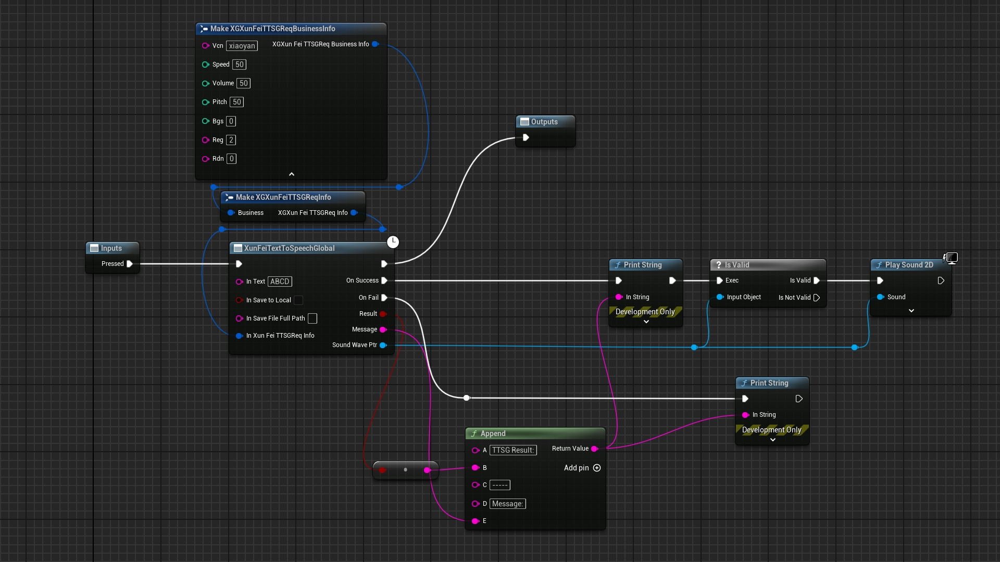    

You can call XunFeiTextToSpeechGlobal to begin TTSG.

It is a async blueprint node.

It converts text to USoundWave and wav file.

#### 7.1 Be Careful:

You have to input the text to convert it.

If you enable bSaveToLocal,you must input the right and absolute file path.

The directory must exist.

The file name must end with ".wav"

You can keep it default for test at first.

#### 7.2 Delegate:

On Success: you will get the USoundWave

On Fail:you will get nullptr and reason.

#### 7.3 ReqInfo:

    

  
  
```
	/**
	 * Parameter:vcn
	 * Type:string
	 * Required:Yes
	 * Description:
	 *		Speaker, optional value: 
	 *		Please add it at the console for trial or purchase. 
	 *		After it is added, the speaker parameter value will be displayed.
	 *		"x_xiaoyan"
	 *		"xiaoyan",
	 *		"aisjiuxu",
	 *		"aisxping",
	 *		"aisjinger",
	 *		"aisbabyxu"
	 *		......
	 * Example:
	 *		"xiaoyan"
	 *
	 */
	UPROPERTY(EditAnywhere, BlueprintReadWrite, Category = "XG iFylTek TTSG")
	FString vcn = TEXT("xiaoyan");

```

```
	/**
	 * Parameter:speed
	 * Type:int
	 * Required:No
	 * Description:
	 *		Speech rate, optional value: [0-100], 50 by default
	 * Example:
	 *		50
	 *
	 */
	UPROPERTY(EditAnywhere, BlueprintReadWrite, Category = "XG iFylTek TTSG")
	int32 speed = 50;

```


```
	/**
	 * Parameter:volume
	 * Type:int
	 * Required:No
	 * Description:
	 *		Volume, optional value: [0-100], 50 by default
	 * Example:
	 *		50
	 *
	 */
	UPROPERTY(EditAnywhere, BlueprintReadWrite, Category = "XG iFylTek TTSG")
	int32 volume = 50;

```

```
	/**
	 * Parameter:pitch
	 * Type:int
	 * Required:No
	 * Description:
	 *		Pitch, optional value: [0-100], 50 by default
	 * Example:
	 *		50
	 *
	 */
	UPROPERTY(EditAnywhere, BlueprintReadWrite, Category = "XG iFylTek TTSG")
	int32 pitch = 50;

```

```

	/**
	 * Parameter:bgs
	 * Type:int
	 * Required:No
	 * Description:
	 *			Background sound of synthesized audio
	 *			0: without background sound (default)
	 *			1: with background sound
	 * Example:
	 *		0
	 *
	 */
	UPROPERTY(EditAnywhere, BlueprintReadWrite, Category = "XG iFylTek TTSG")
	int32 bgs = 0;

```
```


	/**
	 * Parameter:reg
	 * Type:string
	 * Required:No
	 * Description:
	 *		Setting the pronunciation mode for English:
	 *			0：Automatic judgment and processing, if not sure, it will be processed as per spelling of English words (default)
	 *			1：All English is pronounced alphabetically
	 *			2：Automatic judgment and processing, if not sure, it will be read aloud as per letters.
	 *			The pronunciation is as per English word by default.
	 * Example:
	 *		"2"
	 *
	 */
	UPROPERTY(EditAnywhere, BlueprintReadWrite, Category = "XG iFylTek TTSG")
	FString reg = TEXT("2");

```
```
	/**
	 * Parameter:rdn
	 * Type:string
	 * Required:No
	 * Description:
	 *		Pronunciation mode of synthesized audio numbers
	 *		0: Automatic judgment (default value)
	 *		1: Full value
	 *		2: Complete string
	 *		3: String first
	 * Example:		"0"
	 *
	 */
	UPROPERTY(EditAnywhere, BlueprintReadWrite, Category = "XG iFylTek TTSG")
	FString rdn = TEXT("0");

```


You can keep it default for test at first.

The Picture Shows where to add a new speeker.
    

#### 7.4 C++API  

```

	/**
	 * XGXunFeiOnlineTextToSpeechGlobal
	 *
	 * @param WorldContextObject		WorldContext
	 * @param InText					The Str you want to Convert to Audio
	 * @param bInSaveToLocal			Whether to Save to local disk
	 * @param InSaveFileFullPath		The FilePath which the wmv file will save to .
	 * This directory must exist,and the file name must end with ".wav"
	 * This path is absoult path!
	 * @param InXunFeiTTSGReqInfo		About TTS Settins,more to look iflytesk document.you can choos which voice to say,and so on.
	 * @param OnXunFeiTTSGSuccess		if success ,you will get USoundWave.
	 * @param OnXunFeiTTSGFail			if faile,you will get reason.
	 */
	static void XGXunFeiOnlineTextToSpeechGlobal(UObject* WorldContextObject,
		const FString& InText,
		bool bInSaveToLocal,
		const FString& InSaveFileFullPath,
		FXGXunFeiTTSGReqInfo InXunFeiTTSGReqInfo,
		FXGXunFeiTTSGDelegate OnXunFeiTTSGSuccess,
		FXGXunFeiTTSGDelegate OnXunFeiTTSGFail);
```

### Framwork  

XGXunFeiBase    
Process open/ssl->HmacSha256
    
XGXunFeiCore    
Common API Exposed to OtherModule

XGXunFeiSTT    
STT Module

XGXunFeiTTS    
TTS Module

XGXunFeiSpark    
Spark Module

XGXunFeiASRG    
ASRG Module

XGXunFeiTTSG    
TTSG Module

XGXunFeiOther
......(to be added)

XGXunFeiLink  
It contains UE C++ API .

......\Plugins\XGXunFeiLink\Source\XGXunFeiLink\Public\XGXunFeiLinkBPLibrary.h  

Other API is highly customized.
It may be not good for the general design.

  

Remember it：
If you use C++ API,you should add the modules to your "*.build.cs".
```
public class XGXunFeiDemo : ModuleRules
{
	public XGXunFeiDemo(ReadOnlyTargetRules Target) : base(Target)
	{
		PCHUsage = PCHUsageMode.UseExplicitOrSharedPCHs;
	
		PublicDependencyModuleNames.AddRange(new string[] { 
			"Core", 
			"CoreUObject", 
			"Engine", 
			"InputCore","
			 XGXunFeiLink",
			"XGXunFeiCore",
			"XGXunFeiSTT",
			"XGXunFeiTTS",
			"XGXunFeiSpark",
			"XGXunFeiTTSG",
			"XGXunFeiASRG"
        });

		PrivateDependencyModuleNames.AddRange(new string[] {  });


	}
}

```

### Package
No problem~

### Other
This plugin does not contain any iFlyTek's files(\*.h,\*.cpp,\*.lib,......)

This plugin does not contain AI code or AI Model code.

This plugin uses "OpenSSL" to encrypt information in the network,but it will not send data to the Creator("OpenSSL").

This plugin will not send any data to the plugin author.

This plugin was not developed by iFlyTek.

This plugin will only send the interactive data to iFLyTek and recieve the message from iFlyTek . This plugin will not generate any data directly.You must comply with the relevant user and data usage agreements aboutt iFlyTek.These agreements can be found in the iFLyTek website.

The part of plugin code was uploaded to GitHub just for learning.

If the plugin is useful for you. Please purchase it in Unreal Engine Marketplace.

Thanks a lot.

## XGKeDaXunFeiSoud  
TODO.

